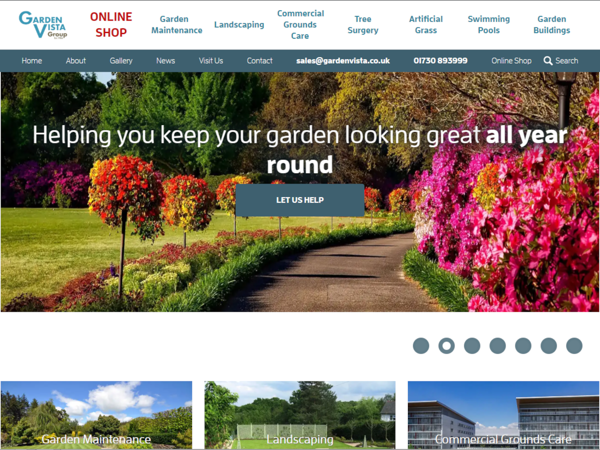

# VGC 

* Contributors: automattic, Hotbox Studios, bobbingwide
* Tags: custom-background, custom-logo, custom-menu, featured-images, threaded-comments, translation-ready
* Requires at least: 4.5
* Tested up to: 5.8.2
* Stable tag: 1.1.0
* License: GNU General Public License v2 or later
* License URI: LICENSE

Theme for gardevista.co.uk

## Description 

VGC is the theme for gardenvista.co.uk.

- It uses/supports Elementor with Elementor-Pro for some of the main pages
- and WooCommerce for the online shop.
- Some of the templates include hardcoded logic which refer to background images.
- The stylesheet also refers to hardcoded background images
- Some of these images are now delivered as part of the theme; instead of being located in wp-content/uploads

## Installation 

1. In your admin panel, go to Appearance > Themes and click the Add New button.
2. Click Upload Theme and Choose File, then select the theme's .zip file. Click Install Now.
3. Click Activate to use your new theme right away.

## Changelog 
# 1.1.0 
* Changed: Replace rand() with harcoded value. #12
* Changed: Don't enqueue wc-atc #13
* Changed: Merge woocommerce/content-single-product.php from Hotbox #12
* Changed: Don't import an empty CSS file from p.typekit.net/p.css #4
* Changed: Replace more images with .webp versions from the theme #8
* Changed: Add theme.json #11
* Changed: Merge smartwp_disable_new_user_notifications() #12
* Changed: Replace CTA images with .webp versions from the theme #8
* Changed: Use WebP background images. Issue #10
* Changed: Switch to WebP images. Set loading=lazy, width and height #8
* Fixed: Use wc_get_cart_url() Fixes #7
* Fixed: Set width and height attributes for logo Fixes #6
* Fixed: Improve header.php Fixes #5
* Fixed: Cater for WooCommerce being deactivated. Fixes #2
* Fixed: Load separate core block assets. Fixes #3
* Fixed: Enqueue typekit and bootstrap CSS locally. Fixes #4
* Fixed: remove support for the Widgets block editor. Fixes #1
* Tested: With PHP 8.0
* Tested: With WordPress 5.8.2

# 1.0.0 
* Version extracted from gardenvista.co.uk on 2021/06/25

# 1.0 - May 12 2015 
* Initial release - of Underscores

## Credits 

* Based on Underscores https://underscores.me/, (C) 2012-2017 Automattic, Inc., [GPLv2 or later](https://www.gnu.org/licenses/gpl-2.0.html)
* normalize.css https://necolas.github.io/normalize.css/, (C) 2012-2016 Nicolas Gallagher and Jonathan Neal, [MIT](https://opensource.org/licenses/MIT)
